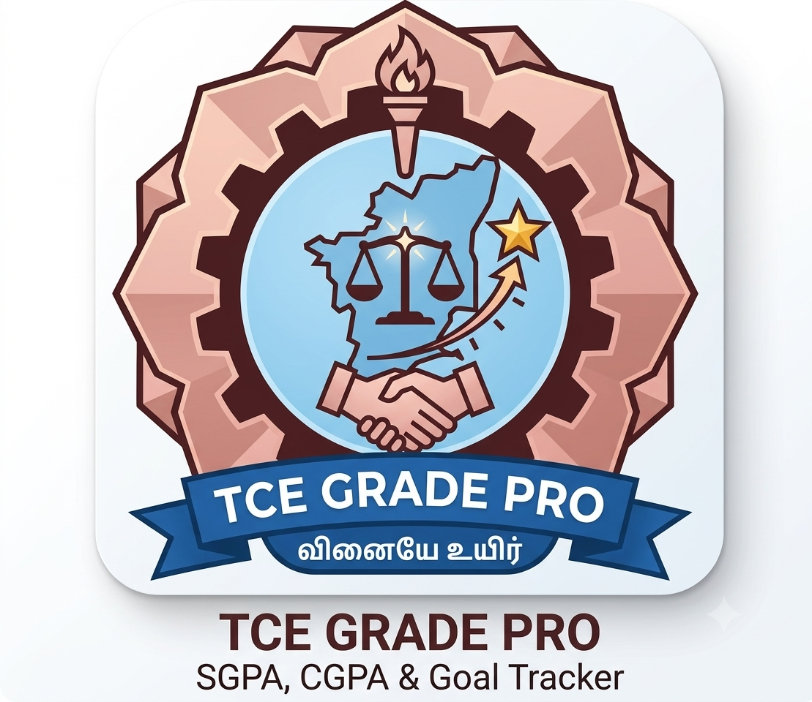

# TCE GradePro

<p align="center">
  
</p>

A robust and user-friendly Android application designed for students of Thiagarajar College of Engineering (TCE) to easily calculate their SGPA, CGPA, and track their academic goals.

## 🚀 Features

- **SGPA Calculator**: 
    - Dynamically add or remove courses.
    - Input grade points and credits for each course.
    - Real-time SGPA calculation.
    - **State Persistence**: Your added courses remain even if you rotate the screen.
- **CGPA Calculator**: 
    - Calculate your overall CGPA by combining your previous academic record with your current semester's results.
- **Goal Tracker**: 
    - Set a target CGPA and find out exactly what SGPA you need to achieve in the current semester to reach it.
    - Handles edge cases (e.g., tells you if a goal is mathematically impossible or already achieved).
- **Modern UI**: Built with Material Design 3 components for a clean and professional look.
- **Robustness**: 
    - Comprehensive input validation to prevent crashes.
    - Automatic keyboard management for a smoother user experience.

## 🛠️ Tech Stack

- **Language**: Kotlin
- **Architecture**: Single Activity Pattern using Jetpack Navigation Component.
- **UI**: View Binding, ConstraintLayout, Material Components.
- **Minimum SDK**: API 24 (Android 7.0)
- **Target/Compile SDK**: API 36

## 🔧 Installation & Setup

1. **Clone the repository**:
   ```bash
   git clone https://github.com/YASHWANTHKUMARD/GPACalculatorReevaluationassistanceTCE.git
   ```
2. **Open in Android Studio**:
   - Open Android Studio and select "Open an Existing Project".
   - Navigate to the cloned folder.
3. **Build and Run**:
   - Let Gradle sync complete.
   - Click the **Run** button or use `Shift + F10`.

## 🛠️ Recent Improvements & Fixes

- **SDK Migration**: Updated project to Android API 36 to support the latest library features and security patches.
- **Stability**: Fixed potential crashes related to number parsing (`NumberFormatException`) by implementing null-safe input handling.
- **UX Fixes**: 
    - Added logic to automatically hide the soft keyboard when calculating results.
    - Fixed a bug where data was lost during screen rotation in the SGPA screen.
- **Formatting**: Standardized GPA display to 2 decimal places using consistent locale settings.

## 📄 License

This project is licensed under the MIT License - see the [LICENSE](LICENSE) file for details.
